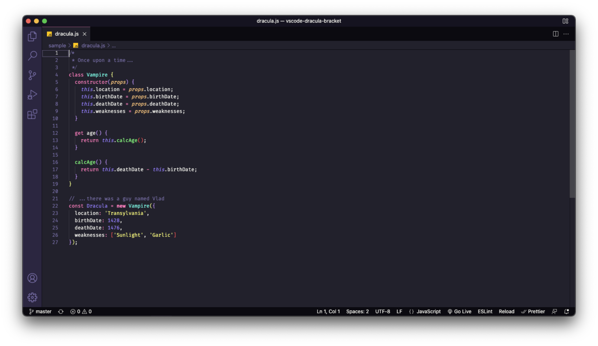

# Dracula for Visual Studio Code Brackets

> A dark theme for Visual Studio Code Brackets.



## Install

- Open the command palette
- Type "open settings"
- You are presented with two options, choose "Open Settings (JSON)"
- Paste the following code:

```json
"editor.bracketPairColorization.enabled": true,
  "workbench.colorCustomizations": {
    "editorBracketHighlight.foreground1": "#f1fa8c",
    "editorBracketHighlight.foreground2": "#bd93f9",
    "editorBracketHighlight.foreground3": "#ff5555",
    "editorBracketHighlight.foreground4": "#ff79c6",
    "editorBracketHighlight.foreground5": "#50fa7b",
    "editorBracketHighlight.foreground6": "#8be9fd",
    "editorBracketHighlight.unexpectedBracket.foreground": "#FF5555"
},
```

## Community

- [Twitter](https://twitter.com/draculatheme) - Best for getting updates about themes and new stuff.
- [GitHub](https://github.com/dracula/dracula-theme/discussions) - Best for asking questions and discussing issues.
- [Discord](https://draculatheme.com/discord-invite) - Best for hanging out with the community.

## Team

This theme is maintained by the following person(s) and a bunch of [awesome contributors](https://github.com/DanielJ06/vscode-dracula-bracket).

| [](https://github.com/zenorocha) |
| ---------------------------------------------------------------------------------------- |
| [Zeno Rocha](https://github.com/zenorocha)                                               |

| [](https://github.com/DanielJ06) |
| ------------------------------------------------------------------------------------------------ |
| [Daniel J Rodrigues](https://github.com/DanielJ06)                                               |

## License

[MIT License](./LICENSE)
